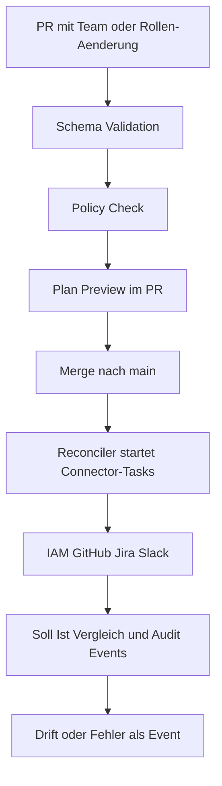

# OaC Enterprise Control Plane MVP (6 Monate)

## Ziel und Rahmen

Dieses Dokument konkretisiert ein realistisches MVP fuer `Organization as Code` im bestehenden Modell `OaC + Enterprise GitOps + GIT OS`.

Das MVP schliesst einen kleinen, aber vollstaendigen End-to-End-Kreis:

- deklarative Aenderung in Git,
- Policy- und Freigabepruefung,
- Reconciliation in Zielsysteme,
- Audit- und Drift-Sichtbarkeit.

Default fuer den Pilot ist `software_company`. Branchenmodule bleiben ueber `policies/process-policy.yaml` umstellbar.

## MVP-Scope

Fokusdomaene:

- Org + Access + Tooling Onboarding.

Enthaltene Change-Typen (Schema v1):

- `team`
- `role_change`
- `joiner_mover`

Nicht im MVP:

- Compensation,
- Performance Management,
- komplexe Finanzplanung,
- autonome AI-Freigaben fuer sensible Themen.

## Referenzfluss

## Repository-Zuschnitt fuer den Pilot

- `org-model` bleibt im aktuellen Repo als modellierende Prozessartefakte (`processes/` + neue Change-Typen) umgesetzt.
- `policy-repo` entspricht den bestehenden Richtlinien unter `policies/`.
- `connector-config` wird initial als Konfigurationsdateien unter `docs/` und spaeter als eigenes Verzeichnis ausgepraegt.
- `schemas/` enthaelt die maschinenpruefbaren Vertragsdefinitionen.

## 6-Monats-Plan

### Monat 1: Modell fixieren

- Kernobjekte und Change-Typen verbindlich machen.
- Zielsysteme fuer Pilot festlegen (IAM, GitHub, Jira).
- Policy-Minimum fuer Freigaben und SoD pruefbar machen.

### Monat 2: Validation und Policy

- CI validiert die neuen Schemas.
- Policy Checks liefern PR-faehiges Feedback.
- Plan-Preview als menschenlesbare Aenderungsfolge.

### Monat 3: Reconciler + erster Connector

- Merge-Ereignis startet Reconciliation.
- Erste reale Zielsystem-Aenderung reproduzierbar und idempotent.
- Audit Trail fuer jede Ausfuehrung.

### Monat 4: Zwei weitere Connectoren

- IAM, GitHub, Jira integriert.
- Retry, Fehlerklassifikation, Idempotenzpfad stabil.

### Monat 5: Observability und Drift

- Soll/Ist-Abgleich mit klaren Drift-Signalen.
- Dashboard fuer Durchlaufzeit, Fehler und Governance.

### Monat 6: Pilotbetrieb

- Ein echter Bereich arbeitet produktiv ueber den Flow.
- `joiner_mover`, `team`, `role_change` laufen Ende-zu-Ende.
- KPI-Review mit Skalierungsentscheidung.

## KPI-Set fuer das MVP

Delivery:

- Lead Time pro Team- oder Rollenwechsel.
- Automationsquote gegen manuelle Tickets.

Governance:

- Policy Violations pro PR.
- Audit Coverage pro ausgefuehrter Aenderung.

User Value:

- Time-to-access fuer neue Mitarbeitende.
- Time-to-team-setup fuer neue Teams.

Platform Health:

- Drift Rate.
- Reconciliation Latency.
- Connector Failure Rate.

## AI-Einsatz im MVP

Erlaubt:

- Planvorschlaege, Policy-Erklaerung, Priorisierungshilfen.

Nicht erlaubt:

- finale Freigaben in sensiblen HR/Finance/Security-Schritten.

Prinzip:

- AI schlaegt vor, Menschen entscheiden.
